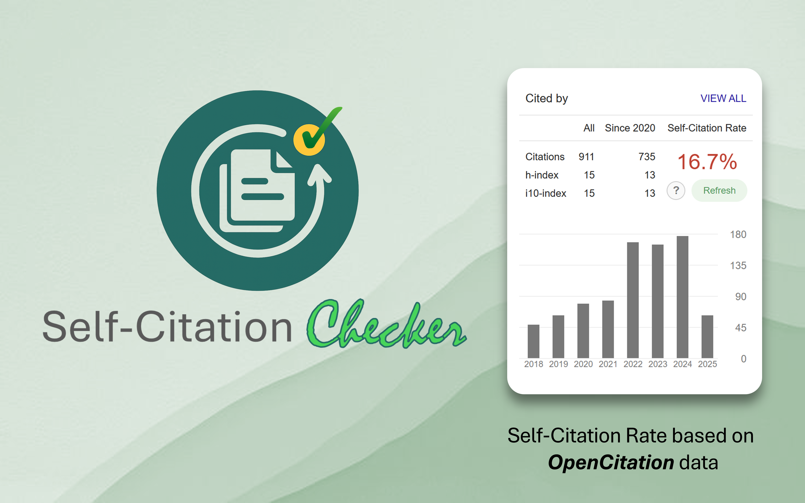

# Self-Citations-Checker

Self-citations can be an essential part of scholarly communication because they
help readers track the evolution of an author's work. When used correctly,
self-citations connect ideas across publications and provide context for
research progress. However, keeping track of your prior work and making sure
it is properly cited can be difficult.

**Self-Citations Checker** is a lightweight Chrome extension that scans your
Google Scholar profile for missing self-citations. The extension highlights any
of your publications that you have not cited when relevant, making it easy to
maintain a consistent citation record.

## Why Self‑Citations Matter

- **Research continuity**: Referencing your previous studies helps other
  researchers understand how your ideas develop over time.
- **Improved discovery**: Properly citing related work increases its
  visibility in scholarly search engines.
- **Accurate metrics**: Citation counts influence how institutions evaluate
  impact. Ensuring you cite your own relevant papers keeps those metrics
  complete.

## Screenshot

Below is a screenshot of the extension in action:

## Install from the Chrome Store

You can install the extension directly from the Chrome Web Store:
[Self-Citations Checker on Chrome Store](https://chromewebstore.google.com/detail/cdikdlblibjpejgihfghambmclimmgaa?utm_source=item-share-cb)

## Contributing

1. Clone this repository.
2. Run `npm install` to install dependencies.
3. Use `npm run build` to compile the TypeScript source.
4. Load the `dist/` directory as an unpacked extension in Chrome for testing.

Pull requests are welcome! Please open an issue first if you plan to make
substantial changes so we can discuss them.

